# 閉域網環境における自律型AIエージェント導入による開発品質向上とコスト最適化の提案

**―Cline/Roo Codeを活用したパイロット案件の策定―**

---

# 目次

1. **技術的優位性の定義**：エージェント型AIの真価
2. **閉域網における実装アーキテクチャ**とセキュリティ要件
3. **既存ツールとの差別化戦略分析**
4. **経済的価値の検証**：コストと費用対効果（ROI）
5. **パイロット導入ロードマップ**と評価指標の策定

---

<!-- _class: lead -->

# 1. 技術的優位性の定義
## エージェント型AIの真価

---

# 1. 概説：AIパラダイムシフト

## 補完型AI → エージェント型AIへの転換

- **Long Context**（20万トークン超）の実現
- **MCP（Model Context Protocol）** の普及（2024年末〜）
- AIは「コード補完ツール」から **「デジタル・エンジニア」** へ

### 従来の補完型AI（GitLab Duo等）の限界
- 単一ファイル内での予測変換に留まる
- プロジェクト全体の整合性維持には人間の介入が必要

---

# 1.1 Agentic Workflow

## 『指示待ち』から『自律実行』への転換

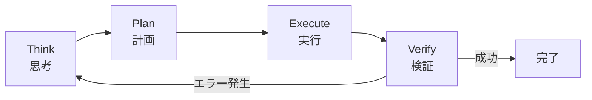

**抽象的なゴール** → AIが自律的にサイクルを回す

---

# 1.1 ワークフローの構造的差異

| 項目 | 補完型AI | エージェント型AI |
|:---|:---|:---|
| **管理主体** | 人間が全体を管理 | AIがプロセスを管理 |
| **ファイル特定** | 人間が行う | AIが自律探索 |
| **修正範囲** | 数行の補完 | 複数ファイル同時修正 |
| **エラー対応** | 人間が確認・修正 | AIが自己修正 |
| **人間の役割** | 全工程に介入 | 最終レビューに専念 |

---

# 1.2 Long ContextとMCPの技術的ブレイクスルー

## Long Context（長大なコンテキスト窓）
- 20万トークン超を一度に処理可能
- プロジェクト全体を「一度に読み込み、理解」
- 断片的なRAGではなく **全体像を把握した矛盾のない修正**

## MCP（Model Context Protocol）
- 2024年11月 Anthropic社発表
- ローカルファイル、DB、API、社内ドキュメントとセキュアに対話

---

# 1.2 MCPによる外部連携

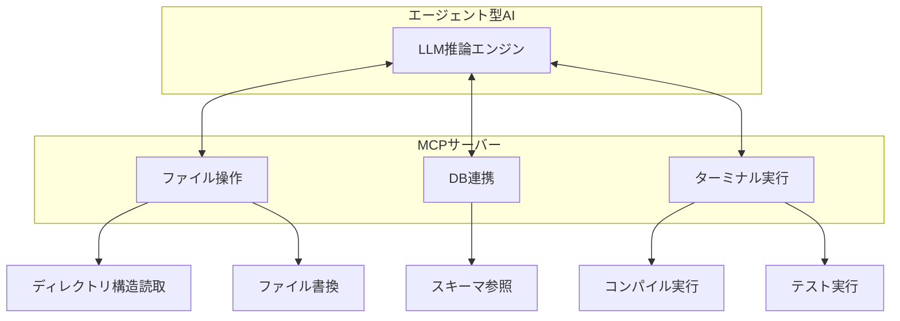

---

# 1.3 開発工程全般への適用範囲

| 工程 | 従来のAI活用 | エージェント型による変革 |
|:---|:---|:---|
| **要件定義・計画** | 参考情報の要約程度 | 実装タスクの自動分解・影響調査 |
| **設計・実装** | 関数単位の補完 | 複数ファイルにまたがる機能実装 |
| **レビュー** | チャットでの断片的指摘 | プロジェクト全体を俯瞰した一貫性チェック |
| **テスト・検証** | テストコードの雛形作成 | テストの自律実行とエラーの自己修正 |

---

# 1.4 モデル選択の柔軟性

## タスク難易度に応じた使い分け

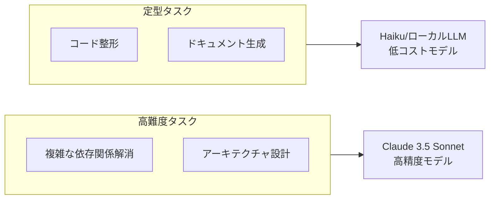

**次案件でのトークンコスト30%以上削減見込み**

---

<!-- _class: lead -->

# 2. 閉域網における実装アーキテクチャとセキュリティ要件

---

# 2. 概説：閉域網でのAI導入

## 最大の懸念事項
- 機密データの外部流出
- 入力データのモデル学習への利用

## 解決策：閉域接続モデル
- Azure OpenAI Service **Private Link**
- AWS Bedrock **Interface VPC Endpoint**
- **インターネットを一切経由しない** 構成が可能

---

# 2.1 閉域網接続アーキテクチャ比較

| 構成要素 | Azure OpenAI Service | Amazon Bedrock |
|:---|:---|:---|
| **閉域接続技術** | Azure Private Link | AWS PrivateLink |
| **オンプレミス接続** | ExpressRoute | Direct Connect |
| **名前解決** | Azure Private DNS Zone | Route 53 Private Hosted Zones |
| **データ保護** | Microsoft DPA | AWS Service Terms (Section 50.3) |
| **特徴** | OpenAI API完全互換 | 複数モデル選択可能 |

---

# 2.1 閉域網内通信フロー

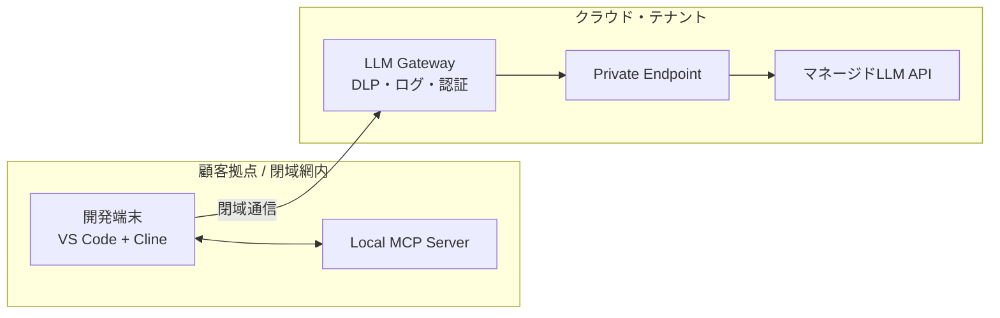

**全ての通信は公衆インターネットを回避**

---

# 2.2 データガバナンスとDLPの重層化

## LLM Gatewayによるリアルタイム制御

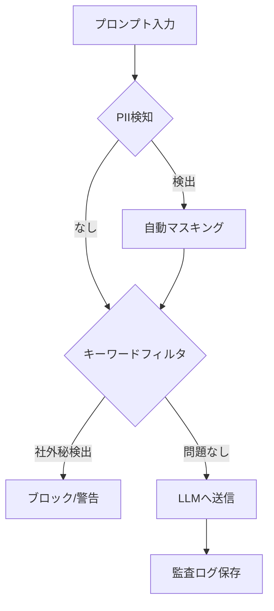

---

# 2.2 DLP実装の3つの柱

| 機能 | 詳細 |
|:---|:---|
| **PII検知・置換** | 社員番号、電話番号、メールアドレス等を自動マスキング（Microsoft Presidio等） |
| **キーワードフィルタリング** | 「社外秘」「部外秘」ラベル含むファイルをブロック |
| **監査ログ全量保存** | 入力（プロンプト）と出力（生成コード）を全て保存、事後監査可能 |

---

# 2.3 モデル選定の論理

## マネージドLLM vs. ローカルLLM

| 評価項目 | マネージドLLM | ローカルLLM |
|:---|:---|:---|
| **推論精度 (Tool Use)** | **最高** | 中 |
| **応答速度** | 高速（スケーラブル） | インフラ依存 |
| **セキュリティ保証** | 規約・法規制による保証 | 物理的隔離 |
| **導入・運用コスト** | **低（従量課金）** | 極めて高い |

---

# 2.3 マネージドLLMを選択する妥当性

## エージェント型AIには高度な推論能力が必須

- ローカルLLMでは複雑なタスクで **指示の取りこぼし** や **論理的矛盾** が発生
- パイロット案件では **Claude 3.5 Sonnet** で品質向上効果を最大化

## 「データ学習への利用禁止」の法的根拠
- **Azure**: 「お客様のデータを基盤モデルの学習に使用しません」
- **AWS**: 「お客様のコンテンツを基盤モデルのトレーニングに使用しません」

---

<!-- _class: lead -->

# 3. 既存ツールとの差別化戦略分析

---

# 3. 概説：JIETERAとの比較

## JIETERA（プラットフォーム型）
- 設計書からコードを生成する **「トップダウン」**
- 新規開発・大規模リプレースに強み

## Cline/Roo Code（エージェント型）
- 既存コードを読み、修正・拡張する **「ボトムアップ」**
- 複雑な既存ロジックの改修に強み

---

# 3.1 JIETERAとエージェント型AIの比較

| 比較項目 | JIETERA | 本提案構成 |
|:---|:---|:---|
| **開発手法** | トップダウン | **ボトムアップ** |
| **既存コードへの適用** | 解析に時間、部分修正困難 | **即座に把握、直接修正可能** |
| **コスト体系** | アカウント数に応じた固定・従量 | **完全従量課金** |
| **ベンダー依存度** | 高い | **極めて低い** |
| **カスタマイズ性** | ベンダー依存 | **MCP開発で無限に連携可能** |
| **適用工程** | 主に新規実装 | **全工程** |

---

# 3.2 既存コードの保守・修正における優位性

## 「継ぎ足し開発」への適応力

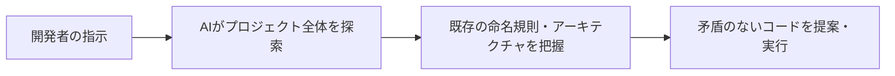

## ターミナル連携による「動くことの担保」
1. AIがコードを修正
2. AIがユニットテストを実行
3. エラーがあればAIが自ら再修正

---

# 3.3 開発工程全般への適用

## 工程別・品質向上効果の期待値

| 工程 | 期待される効果 | 寄与度 |
|:---|:---|:---|
| **事前調査** | 既存コードの影響範囲をAIが自動抽出 | ★★★★★ |
| **計画策定** | タスク分割と工数見積の精度向上 | ★★★☆☆ |
| **実装・修正** | バグ混入の抑制と規約遵守の徹底 | ★★★★☆ |
| **検証・テスト** | テストケースの自動生成と自律実行 | ★★★★★ |

---

# 3.4 独自資産化とベンダーロックイン回避

## MCPによる「社内専用エージェント」への進化

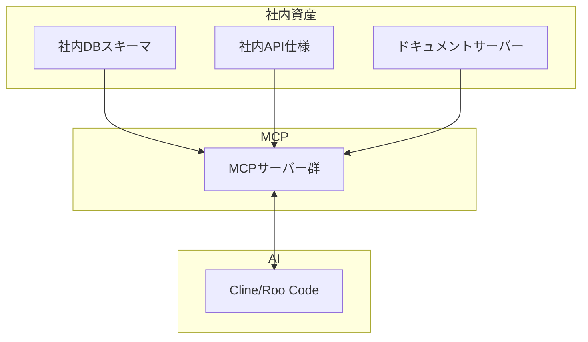

**連携ツール自体が自社の知的財産（IP）に**

---

<!-- _class: lead -->

# 4. 経済的価値の検証
## コストと費用対効果（ROI）

---

# 4. 概説：経済的合理性

## 本提案の主眼
- 単なる短期的な経費削減 **ではない**
- 開発プロセスの **「品質向上」**
- 次案件に向けた **「コスト削減の基盤構築」**

## 試算結果
- 初期投資は **約2.2ヶ月で回収可能**
- 次フェーズ以降の立ち上げ工数を **20〜30%削減**

---

# 4.1 初期導入コスト（CapEx）

## 人件費内訳（1人月170万円ベース）

| 項目 | 想定工数 | 金額 |
|:---|:---|:---|
| インフラ・セキュリティ設計 | 0.75 PM | 1,275,000円 |
| ガイドライン・規約策定 | 0.50 PM | 850,000円 |
| MCPサーバー初期開発 | 1.25 PM | 2,125,000円 |
| オンボーディング研修 | 0.25 PM | 425,000円 |
| **人件費 合計** | **2.75 PM** | **4,675,000円** |

---

# 4.1 初期導入コスト（CapEx）続き

## インフラ・ツール初期費用

| 項目 | 金額 |
|:---|:---|
| クラウド閉域接続構築費 | 300,000円 |
| 監査ログ・監視基盤構築 | 200,000円 |
| セキュリティ・法務審査 | 300,000円 |
| **インフラ/諸経費 合計** | **800,000円** |

### 初期投資 総額（CapEx）
**5,475,000円（税別）**

---

# 4.2 運用フェーズのランニングコスト（OpEx）

## 月間ランニングコスト（5名体制）

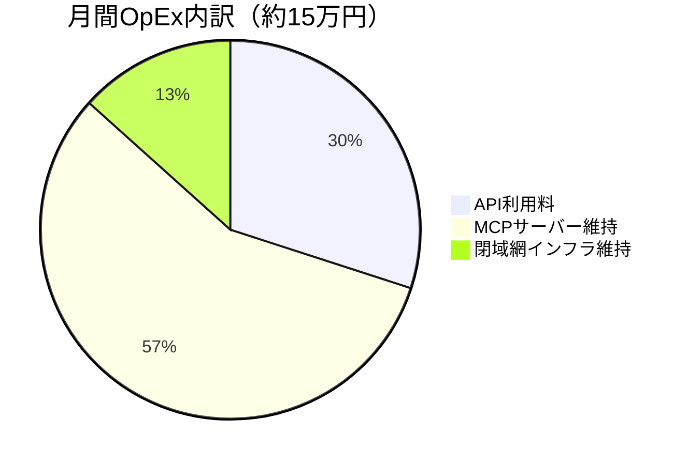

**エンジニア1名あたり月額約3万円**

---

# 4.3 ROI分析：工程別生産性向上

| 評価項目 | 期待削減率 | ROIへの寄与論理 |
|:---|:---|:---|
| **実装・修正** | **40%〜50%** | マルチファイル同時編集と自己修正ループ |
| **コードレビュー** | **50%** | 事前検証済みコードのみを提出 |
| **設計不整合検知** | **15%** | MCP経由で最新仕様を参照 |
| **全体工数削減** | **30%〜40%** | 上記の相乗効果 |

---

# 4.3 投資回収期間（PBP）の導出

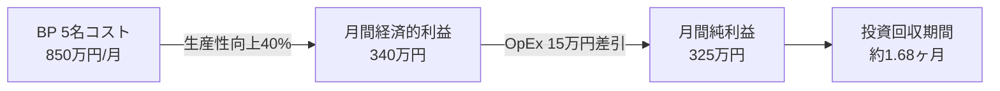

**保守的シミュレーションでも約2.2ヶ月で投資回収**

---

# 4.4 資産化による次期プロジェクトへの波及効果

| 資産 | 効果 |
|:---|:---|
| **ナレッジのプロンプト化（.clinerules）** | 次案件参画者のオンボーディング期間を最大70%短縮 |
| **MCPサーバーの再利用** | 次案件の環境構築工数を20〜30%削減 |
| **品質の平準化** | BPのスキル依存度を下げ、組織全体の品質を一定以上に |

### 初年度ROI：**432%**

---

<!-- _class: lead -->

# 5. パイロット導入ロードマップと評価指標の策定

---

# 5. 概説：パイロット導入の戦略的意義

## 目的
- 4月「要件定義」フェーズを見据えた **「事前調査」**
- 「プロジェクト全体の自律的把握」の実証
- 「多工程（計画・実装・レビュー）の完遂」の検証

## 期間
- **1月〜3月**の約3ヶ月間
- 3つのフェーズに分割

---

# 5.1 段階的パイロット導入ロードマップ

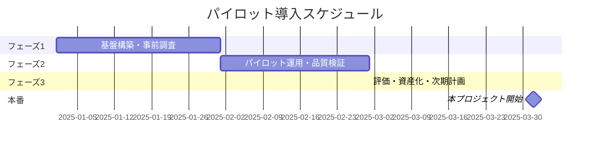

---

# 5.1 各フェーズの詳細

| フェーズ | 期間 | 主な活動 |
|:---|:---|:---|
| **フェーズ1** | 1月 | 閉域網インフラ整備、MCP/DLP Gateway開発、既存ソースのAI解析 |
| **フェーズ2** | 2月〜3月中旬 | BP5名による実業務適用、Agentic Workflow定着、モデル使い分け検証 |
| **フェーズ3** | 3月下旬 | KPIの定量的測定、資産化、次案件コスト削減率の特定 |

---

# 5.2 成功指標（KPI）の設定

## 品質向上指標

| 指標項目 | 定義 | 目標値 |
|:---|:---|:---|
| **AI一次レビュー通過率** | AIが自己修正・テスト完遂したPRの割合 | **70%以上** |
| **手戻り削減数** | 設計不整合に起因するバグ修正数の削減率 | **30%削減** |

---

# 5.2 成功指標（KPI）の設定（続き）

## 生産性向上・資産価値指標

| 指標項目 | 定義 | 目標値 |
|:---|:---|:---|
| **タスク完遂時間** | 要件提示からテストパスまでの時間短縮率 | **40%短縮** |
| **自己修正率** | AIが自律的に修正した回数 | **80%以上** |
| **ナレッジ資産化数** | 再利用可能な資産の数 | **10件以上** |
| **オンボーディング短縮率** | 次回プロジェクトでの期間短縮 | **20-30%削減** |

---

# 5.3 独自資産化による波及効果

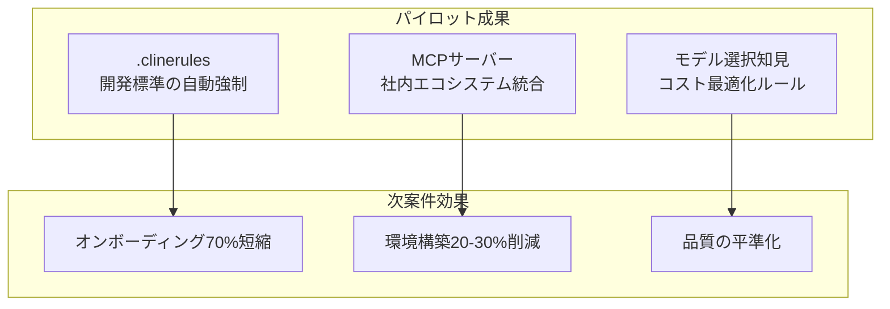

---

# まとめ

## 本提案の価値

1. **技術的優位性**: エージェント型AIによる自律的な開発サイクル
2. **セキュリティ**: 閉域網内で完結するセキュアなアーキテクチャ
3. **差別化**: 既存コードの保守・修正における圧倒的な柔軟性
4. **経済性**: 約2.2ヶ月での投資回収、初年度ROI 432%
5. **将来性**: 独自資産化による次案件への波及効果

---

<!-- _class: lead -->

# ご清聴ありがとうございました

## 本パイロット案件は
## 「次世代開発標準の構築」に直結する
## 戦略的投資です
